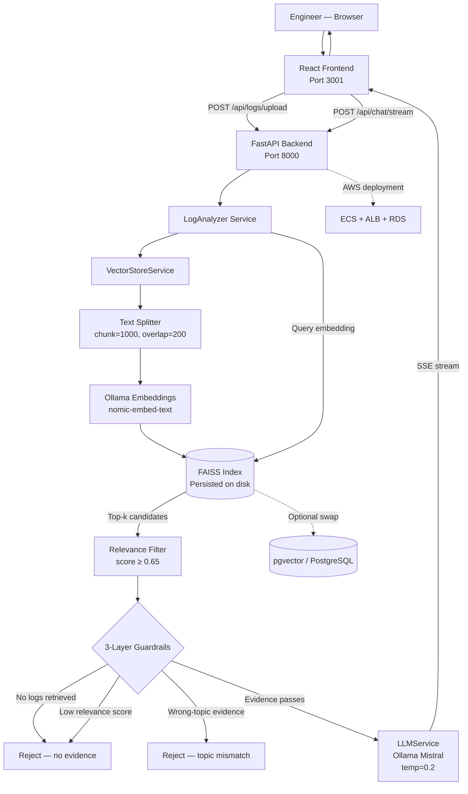

# 🔍 AI Log RCA System — Intelligent Root Cause Analysis for Distributed Services

A full-stack AI application that performs evidence-based root cause analysis on production logs. Logs are chunked, embedded, and stored in a **FAISS vector index**. On query, the system retrieves the most relevant log evidence, applies three-layer hallucination guardrails, and generates a grounded explanation via a **local LLM (Ollama/Mistral)** — with no external API dependencies.


---

## 📌 What This Is

A production-grade AI observability tool that answers the question every on-call engineer dreads: *"Why did this fail?"* — directly from log evidence, not speculation.

Engineers paste or upload their logs, then ask diagnostic questions in natural language. The system retrieves the most relevant log chunks via FAISS vector similarity, enforces three guardrails to prevent fabricated answers, and streams a grounded root cause explanation with full source attribution back to the chat interface.

Built on a local-first, fully containerized stack — no external APIs, no data leaving the machine.

---

## 🏗️ Architecture



**Flow:**
1. Engineer uploads `.log` / `.txt` files or pastes raw log text
2. Logs are chunked (`RecursiveCharacterTextSplitter`, chunk=1000, overlap=200), embedded via `nomic-embed-text`, and stored in a persisted FAISS index
3. On query, the question is embedded and FAISS returns the top-k most similar log chunks
4. Three guardrails filter the result — zero retrieval, low relevance score (< 0.65), or topic keyword mismatch all trigger explicit rejection
5. Passing context is sent to Ollama (Mistral, temp=0.2) which generates a grounded response strictly from the retrieved log evidence
6. Response streams back via Server-Sent Events with source attribution for every retrieved chunk

---

## 🧩 Services

| Service | File | Responsibility |
|---|---|---|
| API layer | `backend/main.py` | FastAPI app — chat, upload, search, health endpoints |
| Log analysis | `services/log_analyzer.py` | RAG orchestration, 3-layer hallucination guardrails |
| Vector store | `services/vector_store.py` | FAISS/pgvector, embedding, chunking, similarity search |
| LLM service | `services/llm_service.py` | Ollama inference, streaming, prompt construction |
| Chat UI | `frontend/src/components/ChatInterface.jsx` | Streaming chat with source attribution |
| Log upload | `frontend/src/components/LogUpload.jsx` | File upload and raw paste interface |

---

## ⚙️ Key Design Decisions

**Three-Layer Hallucination Guardrails**
The system enforces evidence-only responses at three stages — not just in the prompt:
1. **No retrieval** — if FAISS returns nothing, the system rejects immediately: *"No evidence found in logs."*
2. **Relevance threshold** — top relevance score must be ≥ 0.65. Below that, retrieved chunks are considered too weak to ground an answer and the query is rejected.
3. **Topic keyword matching** — for known failure patterns (Kafka rebalance, Kubernetes eviction), the system checks that retrieved chunks actually contain expected log signals before generating. Wrong-topic evidence triggers a specific rejection with the expected signals listed.

**Local-First, Zero External APIs**
Embeddings (`nomic-embed-text`) and inference (`mistral`) both run through Ollama, containerized alongside the backend. No data leaves the machine. The entire stack starts with a single `docker compose up --build`.

**Dual Vector Store**
FAISS is the default — persisted to disk at `/app/faiss_index` and auto-loaded on restart. pgvector (PostgreSQL) is an optional swap enabled via `USE_PGVECTOR=true` — deployed automatically on AWS with RDS. The `VectorStoreService` abstraction makes the switch transparent to the rest of the system.

**Streaming Responses (SSE)**
Both chat endpoints exist in blocking (`POST /api/chat`) and streaming (`POST /api/chat/stream`) variants. The streaming path uses `AsyncIterator` with `text/event-stream` so the UI renders tokens as they arrive. The same guardrails apply in both paths.

**AWS-Ready Infrastructure**
Terraform provisions the full cloud deployment: VPC with public/private subnets, ECS Fargate cluster, Application Load Balancer, RDS PostgreSQL 16 with pgvector extension, and CloudWatch log groups. The local Docker Compose and AWS ECS configs are kept in sync — same images, same environment variables.

---

## 🛠️ Tech Stack

| Layer | Technology |
|---|---|
| API Framework | FastAPI |
| LLM | Mistral via Ollama (local, no API key) |
| Embeddings | nomic-embed-text via Ollama |
| Vector Store | FAISS (default), pgvector/PostgreSQL (optional) |
| RAG Framework | LangChain |
| Text Splitting | RecursiveCharacterTextSplitter (chunk=1000, overlap=200) |
| Frontend | React 18 + Vite |
| Streaming | Server-Sent Events (SSE) |
| Containerization | Docker, Docker Compose |
| Cloud Infrastructure | AWS ECS, ALB, RDS, CloudWatch |
| IaC | Terraform |
| Web Server | Nginx (frontend production) |
| Language | Python 3.11+, JavaScript (React 18) |

---

## 🖥️ Getting Started

### Prerequisites

- Docker and Docker Compose

No external API keys required. Ollama pulls and runs models locally.

### 1. Clone and Start

```bash
git clone https://github.com/Vidhya060501/ai-log-rca-system.git
cd ai-log-rca-system
docker compose up --build
```

This starts:
- **Ollama** on port `11434` — pulls `mistral` and `nomic-embed-text` on first run
- **FastAPI backend** on port `8000`
- **React frontend** on port `3001`

### 2. Access the App

| Service | URL |
|---|---|
| Chat UI | http://localhost:3001 |
| Backend API | http://localhost:8000 |
| Swagger Docs | http://localhost:8000/docs |
| Health Check | http://localhost:8000/health |

### 3. Upload Logs and Query

Upload a `.log` or `.txt` file (or paste raw logs), then ask:

```
Why did the Kafka consumer fail?
Are there timeout errors in the payment service?
Did any Kubernetes pods crash recently?
```

The system retrieves relevant log chunks and streams a grounded explanation. If no relevant evidence is found, it says so explicitly rather than guessing.

### Optional: Enable pgvector

```bash
docker compose --profile pgvector up --build
```

Set `USE_PGVECTOR=true` and `POSTGRES_CONNECTION_STRING` in `backend/.env`.

---

## 📡 API Endpoints

| Method | Endpoint | Description |
|---|---|---|
| `POST` | `/api/logs/upload` | Upload and index log lines into FAISS |
| `POST` | `/api/chat` | Query with full response (blocking) |
| `POST` | `/api/chat/stream` | Query with streaming response (SSE) |
| `GET` | `/api/logs/search?query=...` | Semantic similarity search over indexed logs |
| `GET` | `/health` | Service health — LLM and vector store availability |

**Example: Upload logs**

```bash
curl -X POST http://localhost:8000/api/logs/upload \
  -H "Content-Type: application/json" \
  -d '{
    "logs": [
      "[ERROR] KafkaConsumer: Commit failed due to group rebalance",
      "[WARN] KafkaConsumer: Consumer group rebalancing triggered",
      "[INFO] Reconnecting to broker at kafka:9092"
    ],
    "metadata": {"source": "payment-service", "type": "application"}
  }'
```

**Example: Ask a question**

```bash
curl -X POST http://localhost:8000/api/chat \
  -H "Content-Type: application/json" \
  -d '{"message": "Why did the Kafka consumer fail?"}'
```

**Response:**

```json
{
  "response": "The logs indicate the Kafka consumer failed due to a consumer group rebalance event. Offset commits failed because the consumer lost partition ownership during rebalancing...",
  "session_id": "b3f4a1...",
  "sources": [
    {
      "index": 1,
      "content": "[ERROR] KafkaConsumer: Commit failed due to group rebalance",
      "relevance_score": 0.91,
      "metadata": {"source": "payment-service"}
    }
  ]
}
```

---

## 🐳 Docker Services

| Service | Port | Description |
|---|---|---|
| `frontend` | `3001` | React UI (Nginx in production) |
| `backend` | `8000` | FastAPI + RAG pipeline |
| `ollama` | `11434` | Local LLM + embeddings (Mistral, nomic-embed-text) |
| `postgres` | `5432` | pgvector store (optional — `--profile pgvector`) |

---

## ☁️ AWS Deployment

Infrastructure is fully defined in `aws/terraform/` and deployable with standard Terraform commands:

```bash
cd aws/terraform
terraform init
terraform plan -var="db_password=your_password"
terraform apply
```

**Provisioned resources:**

| Resource | Detail |
|---|---|
| VPC | 10.0.0.0/16 with 2 public + 2 private subnets |
| ECS Cluster | Fargate with Container Insights enabled |
| Application Load Balancer | Public-facing, health check on `/health` |
| RDS PostgreSQL 16 | Private subnet, pgvector extension, gp3 storage |
| CloudWatch Log Group | `/ecs/rca-chatbot`, 7-day retention |
| Security Groups | ECS (8000, 80 inbound), RDS (5432 from ECS only) |

---

## 📂 Project Structure

```
ai-log-rca-system/
├── backend/
│   ├── main.py                      # FastAPI app — all endpoints
│   ├── services/
│   │   ├── llm_service.py           # Ollama LLM — blocking + streaming
│   │   ├── vector_store.py          # FAISS/pgvector, chunking, embeddings
│   │   └── log_analyzer.py          # RAG orchestration + 3-layer guardrails
│   ├── requirements.txt
│   ├── Dockerfile
│   └── .env.example
├── frontend/
│   ├── src/
│   │   ├── App.jsx
│   │   ├── components/
│   │   │   ├── ChatInterface.jsx    # Streaming chat UI + source attribution
│   │   │   └── LogUpload.jsx        # File upload + paste interface
│   │   └── index.css
│   ├── package.json
│   ├── vite.config.js
│   └── nginx.conf
├── aws/
│   ├── terraform/
│   │   └── main.tf                  # VPC, ECS, ALB, RDS, CloudWatch
│   ├── ecs-task-definition.json
│   └── deploy.sh
├── docker-compose.yml
├── Makefile
└── Logs.txt                         # Sample log file for testing
```

---

## 💡 What I Built

The core engineering challenge here isn't RAG — it's preventing the LLM from being confidently wrong. Production log RCA is high-stakes: a hallucinated root cause sends engineers down the wrong debugging path.

The three-layer guardrail system addresses this at the retrieval layer, not just in the prompt:
- **Relevance threshold** (≥ 0.65) prevents weakly-matched chunks from reaching the LLM at all
- **Topic keyword matching** catches cases where the right query hits the wrong logs — e.g., a Kafka question retrieving HTTP timeout logs that the LLM would happily rationalize as relevant
- **Explicit rejection messaging** tells the engineer exactly what log signals were expected but not found, so they know what to upload next

Running inference entirely through Ollama means the system works in air-gapped or data-sensitive environments with no external API dependencies, and the FAISS index persists across container restarts so logs don't need to be re-ingested.

---

## 🚀 Future Roadmap

- [ ] Add structured log parsing (JSON logs, logfmt) before chunking for higher retrieval precision
- [ ] Implement log timeline reconstruction — order retrieved chunks chronologically before generating
- [ ] Add multi-service correlation — surface cross-service causal chains from a single query
- [ ] Build a PagerDuty / Datadog webhook receiver for automatic log ingestion on incident creation
- [ ] Add streaming ingestion for live log tailing (tail -f equivalent via WebSocket)
- [ ] Deploy to AWS ECS with pgvector-backed persistence
- [ ] Add OpenTelemetry instrumentation for retrieval latency observability
- [ ] Experiment with fine-tuned embedding models on log-specific corpora

---

## 🤝 Contributing

Contributions are welcome. To contribute:

1. Fork the repository
2. Create a feature branch:
   ```bash
   git checkout -b feature/your-feature-name
   ```
3. Commit your changes:
   ```bash
   git commit -m "Add: your feature description"
   ```
4. Push and open a Pull Request:
   ```bash
   git push origin feature/your-feature-name
   ```

---

## 💬 Join the Community

- Open an [Issue](https://github.com/Vidhya060501/ai-log-rca-system/issues) for bugs or feature requests
- Start a [Discussion](https://github.com/Vidhya060501/ai-log-rca-system/discussions) for ideas on retrieval strategies or guardrail improvements
- Connect on [LinkedIn](https://www.linkedin.com/in/vidhyadharibandaru) for collaboration

---

## 🙌 Acknowledgements

- [Ollama](https://ollama.ai/) — local LLM inference runtime
- [Mistral](https://mistral.ai/) — the default LLM powering root cause generation
- [FAISS](https://github.com/facebookresearch/faiss) — Facebook's vector similarity search library
- [LangChain](https://www.langchain.com/) — RAG framework and document handling
- [FastAPI](https://fastapi.tiangolo.com/) — async API framework
- [pgvector](https://github.com/pgvector/pgvector) — vector similarity search extension for PostgreSQL

---

## 🛡️ License

This project is licensed under the [MIT License](LICENSE).

---

<p align="center">
  Built by <a href="https://github.com/Vidhya060501">Vidhyadhari Bandaru</a> ·
  <a href="https://www.linkedin.com/in/vidhyadharibandaru">LinkedIn</a> ·
  <a href="mailto:vidhyadhari060501@gmail.com">Email</a>
</p>
